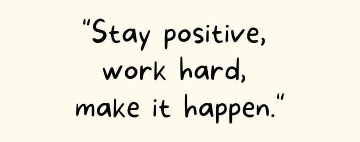

# Welcome to My Visual Analytics Journey!

\
This page will show what I learn and practice in the **ISSS608 Visual Analytics and Applications course**. Here, you can see the work I do as I learn more about how to show data in interesting ways.

\

### What I Want to Achieve 🌟

My main goal for this course is to really understand how to use pictures to explain data well. I'm excited to learn how to make clear and interesting visuals that tell a story.

For me, getting better over time is what's most important. I believe that if I keep trying hard, I will learn a lot and improve.

*I promise to push myself and do even better this time. I'm ready to face any challenges and learn from them.*
